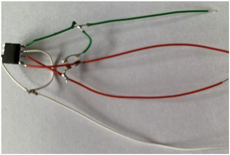
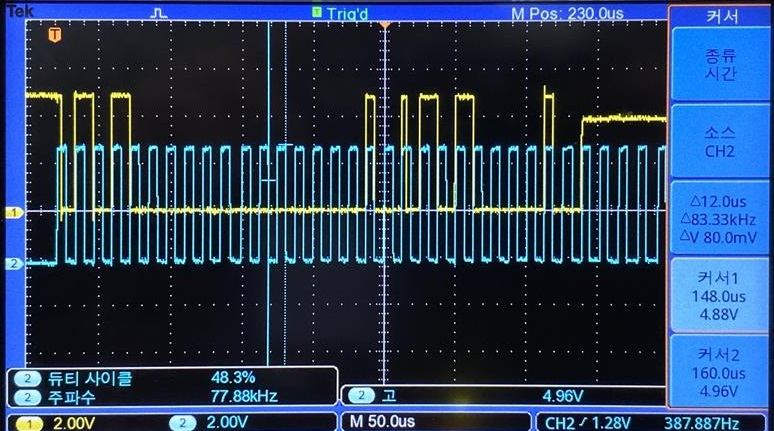

## 환경
    C, CodeVision, Oscilloscope, Atmega128a
## 학습 내용
    1. 데이터시트 보는 법
    2. I2C, UART, ADC 등 사용 가능한 기능 및 관련된 레지스터의 이름과 역할
    3. Timer와 Interrupt
    4. ICE 장비로 코드 전송
    
## 실습
    1. Polling I2C 구현 프로젝트
    2. UART, 1602 LCD, ADC, Timer, Interrupt 등의 기능 구현 프로젝트
## 사진
|  |  |
|:---:|:---:|
| *Wired EEPROM* | *Oscilloscope (I2C)* |
